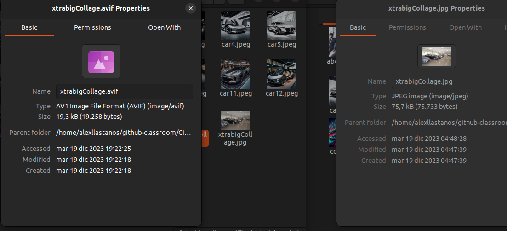

[](https://classroom.github.com/a/IDHYgx5Z)

# MP9 DAW - UF2 Project - Multimedia resources in WebApps

## Project Goals

- Add the multimedia resources to a web project (images, videos, etc.).
- Optimize the multimedia resources to improve the performance of the web.
- Use different tools and techniques for optimizing multimedia resources.
- Learn about image-related and integrated tools in web development environments.

## Background

This last days we've been seeing different tools and techniques for optimizing multimedia resources. We've seen how to change the format of an image, how to reduce its size previous to its use in a web.

Let's see some of the core concepts on image optimization:

- **Prefer Vector Formats:**

  - Vector images are resolution and scale independent, suitable for multi-device and high-resolution environments.

- **Minify and Compress SVG Assets:**

  - Remove unnecessary metadata from XML markup in SVG assets.
  - Ensure servers are configured for GZIP compression for SVG assets.

- **Prefer WebP or AVIF Over Older Raster Formats:**

  - WebP and AVIF images are usually smaller than older formats.

- **Pick Best Raster Image Format:**

  - Determine functional requirements and select the format that suits each asset.

- **Experiment with Optimal Quality Settings for Raster Formats:**

  - Don't hesitate to reduce "quality" settings; the results are often good with significant byte savings.

- **Serve Scaled Images:**

  - Resize images to ensure the "display" size is close to the "natural" size.
  - Pay attention to large images as they contribute to significant overhead when resized.

- **Automate, Automate, Automate:**
  - Invest in automated tools and infrastructure to ensure continuous optimization of all image assets.

Images are very important for the responsiveness of our website. But also it is very important the size of these images as we grow our website.

In this project we're goint to work with the same website we worked in our first project but we're going to incorporate some key-points that will be very helpful for your future projects. Let's see what are we going to be working with:

### Background key-points

Here you have some information that you'll need throughout the project:

1. **Responsive Images**

   - **Resources:**
     - [MDN Web Docs - Responsive Images](https://developer.mozilla.org/en-US/docs/Learn/HTML/Multimedia_and_embedding/Responsive_images)
     - [W3Schools - Responsive Images](https://www.w3schools.com/html/html_responsive_images.asp)
     - [CSS-Tricks - Responsive Images](https://css-tricks.com/responsive-images-css/)
     - [Web.DEv - Optimize your images](https://web.dev/articles/choose-the-right-image-format/)

2. **SVG and Cli-Path:**

   - **Resources:**
     - [W3Schools - SVG Tutorial](https://www.w3schools.com/graphics/svg_intro.asp)
     - [CSS-Tricks - A Comprehensive Guide to SVG](https://css-tricks.com/svg-guide/)

3. **Imagemin and Sharp:**

   - **Resources:**
     - [Imagemin - GitHub Repository](https://github.com/imagemin/imagemin)
     - [Sharp - GitHub Repository](https://github.com/lovell/sharp)
     - [Parcel - Image Optimization](https://parceljs.org/recipes/image/)

4. **CSS Animations (Keyframes):**

   - **Resources:**
     - [MDN Web Docs - CSS Animations](https://developer.mozilla.org/en-US/docs/Web/CSS/CSS_Animations)
     - [CSS-Tricks - A Guide to CSS Animation](https://css-tricks.com/snippets/css/keyframe-animation-syntax/)

5. **Comparison with PageSpeed Insights and Lighthouse:**
   - **Resources:**
     - [PageSpeed Insights - Google Developers](https://developers.google.com/speed/pagespeed/insights/)
     - [Lighthouse - Google Developers](https://developers.google.com/web/tools/lighthouse)

## Project Goals - WHAT I NEED TO DO.

Starting from your website from the first project, you'll need to ensure the following requirements. This is, you've to make the necessary changes, if not yet implemented, to ensure that your website meets the following requirements:

1. **Header and Footer:**

   - Design a simple header with a title and a basic logo created by you.

   El que he fet jo al header ha set posar el nav perque és on va normalment la barra de navegació.

   ```html
   <header>
     <nav
       class="flex flex-row justify-between items-center bg-stone-800 text-white h-16"
     >
       <div class="ml-2">
         <a href="index.html"
           ></a>
       </div>
       <div class="right">
         <!-- <button class="flex justify-between items-center p-8 sm:hidden">
          <i class="fa-solid fa-bars"></i>
        </button> -->
         <ul class="flex justify-between items-center sm:p-8 ">
           <li class="mx-4">
             <a href="cars.html">Cars</a>
           </li>
           <li class="mx-4">
             <a href="about.html">About</a>
           </li>
           <li class="mx-4">
             <a href="links.html">Links</a>
           </li>
         </ul>
       </div>
     </nav>
   </header>
   ```

   - Create a footer with links to all pages.

   I aqui depres he creat el footer amb un link a cada pagina i el que he fet ha set posar una llista amb els links i despres un paragraf amb el copyrigth.

   ```html
   <footer class="bg-stone-800 text-white py-4 text-center">
       <nav>
         <ul class="flex justify-center">
           <li class="mx-4"><a href="index.html">Home</a></li>
           <li class="mx-4"><a href="cars.html">Cars</a></li>
           <li class="mx-4"><a href="about.html">About</a></li>
           <li class="mx-4"><a href="links.html">Links</a></li>
         </ul>
       </nav>
       </br
       <p>&copy; 2023 Llastanos's Dealership. All rights reserved.</p>
   </footer>
   ```

2. **Responsive Design:**

   - Ensure the WHOLE website is responsive for various devices.

   El projecte ja era bastant resonsive pero hi havia 3 pàgines que fallaven i els canvis que he fet han set els seguents.

   Primer el que ha set afegir a la classe del body el min-h-screen perque aixi el body ocupa tota la pantalla, tambe el que he fet ha set posar-li el flex-1 al main perque ocupi l'espai necessari i el footer es quedi sempre a la part d'abaix de la pagina , aixi es soluciona el problema que hi havia que era que quan es feia zoom el footer quedava al mig i les lletres no es veien be perque tot els elements estaven barrejats.
   ;
   ;

   Aquests canvis els he fet a les pàgines de l'index, poenix, draco i links.

   ```html
   <body class="bg-slate-400 flex flex-col min-h-screen">
     <main
       class="flex flex-col items-center md:flex-row mt-20 justify-center h-[80vh] flex-1"
     ></main>
   </body>
   ```

   El seguent canvi ha set que la pantalla quan sigui mes petita que sm el text es centri i no tingui padding right perque sino esteticament no es veu be.
   I hem passat de tenir aixo:

   ```html
   <div class="w-1/2 flex flex-col justify-center items-center">
     <h1 class="text-4xl font-bold mb-5 text-left">Welcome to our website</h1>
     <p class="text-lg mb-5 pr-7 text-left"></p>
   </div>
   ```

   ;

   A tenir aixo:

   ```html
   <div class="w-1/2 flex flex-col justify-center items-center">
     <h1 class="text-4xl font-bold mb-5 text-center sm:text-left">
       Welcome to our website
     </h1>
     <p class="text-lg mb-5 sm:pr-7 text-center sm:text-left"></p>
   </div>
   ```

   ;

   Tambe el que he fet ha set que quan la pantalla sigui petita ja no es surti aquella icona i es mantingui el nav normal que l'unic que havia de fer era comentar la part del boto i treure tots els sm: que hi havien al ul perque aixi quan la pantalla era petit es mostres be i nomes he deixat el sm:p-8 perque si la pantalla era petita es decentrava.

   ```html
   <div class="right">
     <!-- <button class="flex justify-between items-center p-8 sm:hidden">
          <i class="fa-solid fa-bars"></i>
        </button> -->
     <ul class="flex justify-between items-center sm:p-8 "></ul>
   </div>
   ```

 - Incorporate the use of different images (resolution/size) for different devices.

   El que he fet ha set que depenent de la mida de la pantalla posi la primera imatge o la segona, aixo ho he fet amb el hidden md:block que el que fa es que si les pantalles son mitjanes o mes grans que es mostri si no no es mostra tambe es podria fer postant-li sm:hidden al hidden que tenim per obtenir el mateix resultat i en la segona hem fet el contrari posar-li md:hidden lg:hidden xl:hidden perque nomes es mostri quan la pantalla es petita .

 ```html
 -Imatge 1
 
 -Imatge 2
 
````

- Incorporate at least one different crop of an image for different devices.

  Jo el que he fet ha set que l'imatge de l'about el que faci es que depenent del dispositiu que estiguis sigui mes gran o mes petita.

  ```html
  
  ```

3. **Image Optimization:**

   - Make a decision about the format that you want to use for your images and explain why you've chosen that format.

   Jo he triat el format AVIF perque he vist que es dels que manté mes qualitat a l'hora de comprimir l'imatge de la pagina web. Perque buscant per internet he vist que la millor eficiencia a l'hora de comprimir imatges es el format AVIF.

   - MANUALLY (as you have done with the tasks in this UF) optimize at least two images on the website.

     Jo he comprimit les imatges manualment amb el programa squoosh que es un programa que et permet veure el grau de compressio de les imatges i el resultat avans de comprimir-les aixi pots descarregar nomes quan vegis que la compressio i la qualitat de l'imatge es el que vols. Les dues imatges que he comprimit manualment han set les dues de la pagina principal.

     

     Per exemple l'imatge xtrabigCollage.jpeg que pesava 75kB l'he comprimit amb el squoosh i ara pesa 19kB i la qualitat no varia gaire.

     

   - Investigate and show how to optimize an image using Imagemin or Sharp.

    Per optimitzar les imatges amb imagemin el que has de fer primer es executar la seguent comanda per instalar-lo.

    ```bash
    npm install imagemin-mozjpeg imagemin-webp
    ```
    I despres quan ja el tinguis instalat executes aquesta comanda perque t'optimitzi les imatges de la carpeta que li diguis a la carpeta que li diguis.

    ```bash
    npx imagemin ./img/* --out-dir=dist/imagemin --plugin=mozjpeg --plugin=webp
    ```

   - Use Parcel to AUTOMATE the optimization of images of your website.
     Per instalar el parcel el que has de fer primerament es executar la comanda
     ```bash
     npm install -D parcel-bundler
     ```
     Despres hi has d'afegir aquestes tres linies al package.json
     ```json
     "scripts": {
     "dev": "parcel src/index.html && parcel src/index.html --open",
     "build": "parcel build src/index.html"
     }
     ```
     I per ultim executar la comanda
     ```bash
     npm run dev
     ```

> **IMPORTANT** You'll have to create a video-tutorial of **no more than 2min** explaining how to optimize an image using Imagemin or Sharp + how to use Parcel to automate the optimization of images of your website. Finally you'll have to add it to your documentation (you can upload it or embed it as a youtube video).

4. **CSS Clip-Path & Animations:**

   - Add a CSS animation to an element on the homepage.
     El que he fet es que el boto del see cars tingui una animació que quan carrega la pagina que faci un animation-pulse 3 cops perque aixi resalti mes. I crida l'atenció de l'usuari perque el cliqui.

   ```html
   <a
     href="./cars.html"
     class="animate-pulse bg-yellow-400 hover:bg-yellow-300 text-black font-bold py-2 px-4 rounded mb-10"
     style="animation-iteration-count: 3;"
   >
     See Cars
   </a>
   ```

   - Add also a CSS clip-path to an element on the homepage.

   Aqui el que he fet ha set amb l'imatge que surt quan la pantalla es fa petita he fet que tingui una forma d'un cercle amb el clip-path:circle.

   ````html
   
   ```
   ````

5. **Documentation:**
   - Document the development process with a focus on image optimization decisions.
   - Embed the short video tutorial demonstrating manual image optimization. You can add it on the links site of your documentation.

### Structure Reminder

You need to follow the structure of the first project. Ther're some changes but the general structure keeps the same.

#### Homepage

- Include at least one graphic resource edited with clip-path. Get creative! Cut an image and create a shape that integrates well into the page.

#### Detail Page

- Add a representative featured image that explains the page's content.
- Ensure the image is well-integrated into the design for both mobile and larger screens.
- Include at least two additional images (excluding header and footer), preferably in various formats (properly justified in the practice documentation).

#### Category Page

- Display the chosen featured image from the detail page, similar to platforms like Amazon, where a small image is visible during a search, and it enlarges when you enter the product page.

#### Presentation Page

- Include at least one graphic resource made with SVG on this page.
- The SVG should have a small animation using CSS.

#### Links Page

- Add your video tutorial to the links page.
- It's very important to be sure about the use of copyrighted material.
- Ensure compliance with limits and exceptions when using copyrighted materials.
- All resources requiring acknowledgment of rights must be correctly recognized and linked on this page.

## Evaluation Criteria:

**Development (70%):**

- Creation and/or modification to use of the appropriate format of images (20%).
- Adaptation of the resources to a responsive design (20%).
- Clip-Path and Animation (15%).
- Use of image-optimization tools (15%).

**Documentation (30%):**

- Documentation of the development process (10%).
- Brief justification for image optimization choices (10%).
- Embedded video tutorial for manual image optimization (10%).

**Important Note:**
Ensure that the documentation includes links to the code repository and the public URL of the

### Intellectual Property and Plagiarism

When creating multimedia works, it is often unavoidable to use resources created by third parties. It is understandable to do so within the framework of a practice in the studies of this Master's program, as long as it is clearly documented and does not constitute plagiarism in practice.

Therefore, when submitting a practice that uses third-party resources, it should be accompanied by a document detailing the resources used. This document should specify the name of each resource, its author, where it was obtained, and its legal status — whether the work is protected by copyright or falls under another usage license (Creative Commons, GNU, GPL, etc.). The student must ensure that the chosen license does not explicitly prohibit its use within the scope of the practice. If the corresponding information cannot be found, it should be assumed that the work is protected by copyright.

Additionally, when digital works are used, the original files must be attached, and their source code, if applicable.


